<div align="center">
  
</div>

<div align="center">

[](https://github.com/unkn0tted)
[](https://github.com/unkn0tted?tab=followers)
[](https://github.com/unkn0tted?tab=repositories)

</div>

```console
root@unknown:~$ whoami
> A builder turning vague ideas into sharp, useful software.

root@unknown:~$ cat current_mission.txt
> Local-first desktop tools · Modern web systems · Practical automation

root@unknown:~$ status
> ONLINE — shipping, learning, iterating.
```

## `// ABOUT_ME`

I enjoy building software that feels **fast, focused, and intentional** — from
native-feeling desktop tools to modern web experiences.

- 🧩 Turning complicated workflows into simple products
- 🖥️ Exploring the boundary between **Web UI** and **native capabilities**
- 🤖 Connecting useful AI APIs to real-world workflows
- ⚙️ Caring about reliability: checkpoints, CI/CD, automation, and good DX
- 🌌 Currently wandering through the unknown — one commit at a time

## `// TECH_ARSENAL`

<div align="center">

[](https://skillicons.dev)

</div>

<details>
<summary><b>⚡ SYSTEM DIAGNOSTICS</b></summary>
<br>

```yaml
profile:
  handle: unkn0tted
  mode: builder
  focus:
    - desktop_apps
    - frontend_engineering
    - ai_integrations
    - developer_experience

runtime:
  strongest_signal: TypeScript
  native_layer: Rust + Tauri
  web_stack: React + Next.js + Tailwind CSS
  tooling: Vite + Bun + GitHub Actions

philosophy:
  - "Make it useful."
  - "Make it resilient."
  - "Then make it beautiful."
```

</details>

## `// FEATURED_TRANSMISSIONS`

<table>
  <tr>
    <td width="50%" valign="top">
      <h3 align="center">🎬 Subtitle Duet</h3>
      <p align="center">
        <a href="https://github.com/unkn0tted/SRTtoSRT">
          
        </a>
      </p>
      <p>
        A local-first bilingual subtitle workspace powered by
        <code>Tauri v2</code>, <code>TypeScript</code>, and <code>Rust</code>.
        Built for batch processing, resumable tasks, and OpenAI-compatible APIs.
      </p>
    </td>
    <td width="50%" valign="top">
      <h3 align="center">🧬 More Incoming</h3>
      <br>
      <p align="center">
        <code>IDEA</code> → <code>BUILD</code> → <code>SHIP</code> → <code>REPEAT</code>
      </p>
      <br>
      <p>
        New experiments are forming in the void. Check the repositories tab for
        the latest signal.
      </p>
      <p align="center">
        <a href="https://github.com/unkn0tted?tab=repositories">
          
        </a>
      </p>
    </td>
  </tr>
</table>

## `// GITHUB_TELEMETRY`

<div align="center">
  <picture>
    <source
      srcset="https://github-readme-stats.vercel.app/api?username=unkn0tted&show_icons=true&hide_border=true&rank_icon=github&theme=transparent&title_color=a78bfa&icon_color=22d3ee&text_color=cbd5e1&bg_color=00000000"
      media="(prefers-color-scheme: dark)"
    >
    <source
      srcset="https://github-readme-stats.vercel.app/api?username=unkn0tted&show_icons=true&hide_border=true&rank_icon=github&title_color=6d28d9&icon_color=0891b2&text_color=334155&bg_color=00000000"
      media="(prefers-color-scheme: light)"
    >
    
  </picture>
  <picture>
    <source
      srcset="https://github-readme-stats.vercel.app/api/top-langs/?username=unkn0tted&layout=compact&hide_border=true&theme=transparent&title_color=a78bfa&text_color=cbd5e1&bg_color=00000000"
      media="(prefers-color-scheme: dark)"
    >
    <source
      srcset="https://github-readme-stats.vercel.app/api/top-langs/?username=unkn0tted&layout=compact&hide_border=true&title_color=6d28d9&text_color=334155&bg_color=00000000"
      media="(prefers-color-scheme: light)"
    >
    
  </picture>
</div>

<div align="center">
  
</div>

## `// ESTABLISH_CONNECTION`

<div align="center">

**Interesting idea? Useful collaboration? Just want to say hi?**

[](https://github.com/unkn0tted)

<br>

<sub>「未知不是障碍，是入口。」</sub>

<br><br>


</div>
